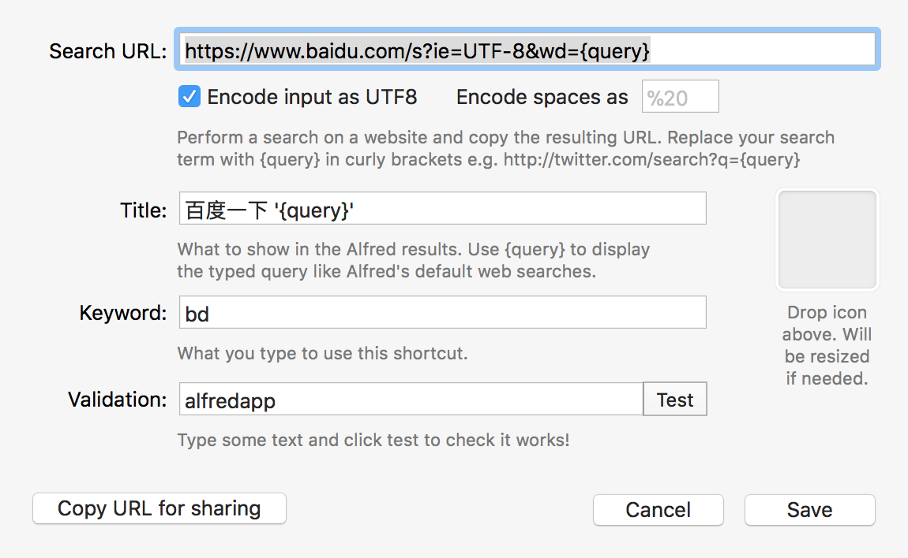

增加一个自定义浏览器搜索，如百度：
webSearch -> Add custom search ->

修改默认搜索引擎：
Features -> Default Results -> setup fallback results -> 可以删除不想要的，也可以增加一个自定义的浏览器搜索

如何创建一个WorkFlow：

## 我第一次写workflow的经历

workflow底部➕ ，增加一个Blank Workflow，填写相关的内容，新建一个Inputs->keyword 
填写相关的内容，如果不需要参数，应该选择No Argument
然后右键Inputs空间，Insert After，加一个Action -> Run Script

##  参考网页：

http://myg0u.com/python/2015/05/23/tutorial-alfred-workflow.html
https://www.zhihu.com/question/22301362

## Chrome书签保存地址：

PROFILE="~/Library/Application\ Support/Google/Chrome/Default/Bookmarks"

