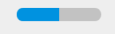
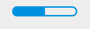

```Xml
<?xml version="1.0" encoding="utf-8"?>
<layer-list xmlns:android="http://schemas.android.com/apk/res/android">
    <!--
    对layer-list样式，是按照顺序堆叠的，所以最上层的放在最后面，而且如果设置了progressDrawable
    的属性，再去设置progressbar的background是没有效果的
    -->
    <item android:id="@android:id/background">
        <shape>
            <corners android:radius="10dp" />         <!-- 圆角 -->

            <solid android:color="@color/gyGrey" />   <!-- 描边 -->
        </shape>
    </item>
    <item android:id="@android:id/progress">
        <clip>
            <shape>
                <corners android:radius="10dp"/>
                <stroke android:color="@color/gyGrey"
                        android:width="2dp"/>
                <gradient
                    android:angle="0"
                    android:startColor="@color/gyGreen"
                    android:endColor="@color/gyDeepGreen"/>
            </shape>
        </clip>
    </item>
</layer-list>
```


- 效果图

  

```Xml
<?xml version="1.0" encoding="utf-8"?>
<layer-list xmlns:android="http://schemas.android.com/apk/res/android">
    <item android:id="@android:id/background">
        <shape>
            <corners android:radius="38dp" />
            <stroke
                android:width="2dp"
                android:color="@color/btn_blue" />
            <solid android:color="@android:color/transparent" />
        </shape>
    </item>

    <item android:id="@android:id/progress">
        <clip>
            <shape>
                <corners android:radius="38dp" />
                <solid android:color="@color/btn_blue" />
            </shape>
        </clip>
    </item>
</layer-list>
```

- 效果图

  

