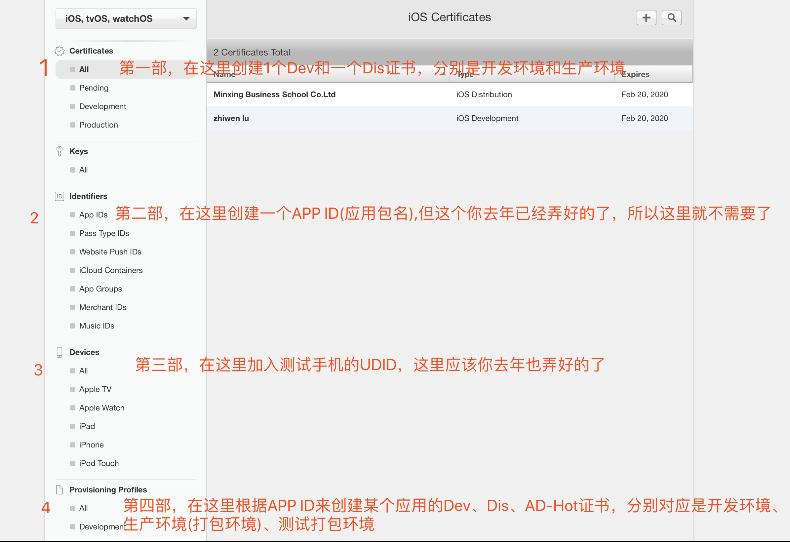
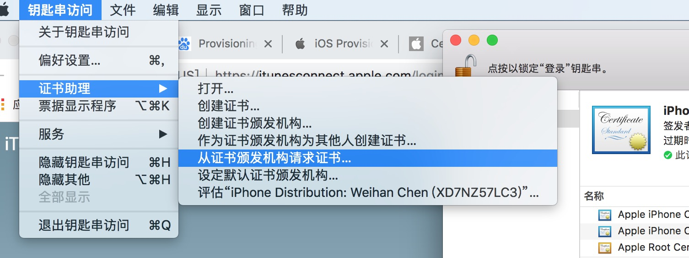
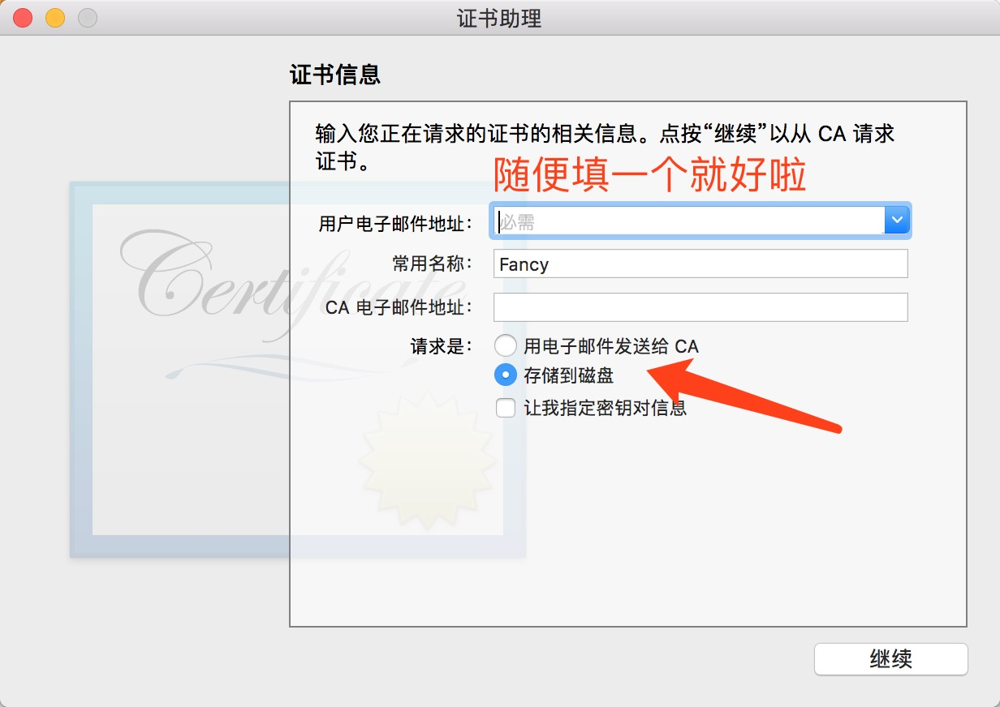
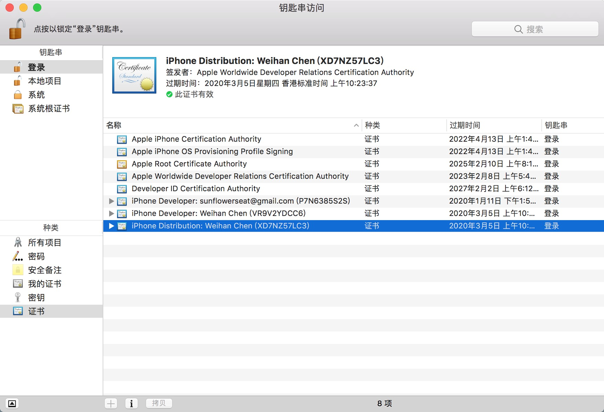

## iOS系统证书讲解

## 自己电脑创建证书

### 钥匙串

- 如何导出CA证书

  钥匙串访问 - 证书助理 - 从证书颁发机构请求证书

  

  填写相关信息 并导出证书到电脑上面

  

- 如何查看当前电脑上的证书

  

  这些证书全都可以删掉~~

### 苹果开发者账号 `https://developer.apple.com`

- 证书俗解

  - 第一次开发产品，还没有证书

      > 简单地说，有一个质量监控审核中心(Apple)  你想生产一款产品(App)
      >
      > 首先你得注册一个公司(***注册一个Apple账号***)，然后你得有个工厂，也就是生产的地址(Computer)，生成一个地址凭证(***钥匙串中的CA证书*** 后缀是`.certSigningRequest`)
      >
      > 有了这个公司的地址凭证(CA证书) 就可以向质量监控审核中心(Apple) 申请生产资质证书(Certificate,后缀`.cer`) 了
      >
      > 这时候 你可以申请两种证书 
      >
      > 第一种是研发产品证书(***Cer_Development***) 有了这个证书 证明你有在某工厂研发产品的资格
      >
      > 第二种是 正式产品证书(***Cer_Production***) 有了这个证书 代表你有在某工厂生产产品的资格
      >
      > 
      >
      > 现在你具备在某个工厂进行生产的资格了，你可以把这两个证书贴到你的工厂里面(***双击证书安装至钥匙串中***)。
      >
      > 接下来你想生产一个叫做 AppId-xxx的产品，所以你需要向质量监控审核中心(Apple) ***申请一个生产AppId-xxx***的资质凭证(Provisioning Profiles,后缀`.mobileprovision`)
      >
      > 第一种是研发AppID-xxx产品的资质凭证(***Prov_Development***)  你可以在某工厂研发名为AppId-xxx的产品
      >
      > 第二种是打包生产AppID-xxx产品的资质凭证(***Prov_Distribution***) 你可以在某工程打包生产名为AppId-xx的产品
      >
      > 
      >
      > 你已经具备打包生产一个产品的全部资格证书了，接下来是把证书放到相应的地方
      >
      > 在Build Settings -> Code Signing Identity中
      >
      > 把研发环境的Developer设置成***Cer_Development***
      >
      > 把生产环境的Developer设置成***Cer_Production***
      >
      > 在General中
      >
      > ***配置Prov_Development 到研发环境中(Debug环境)***
      >
      > ***配置Prov_Distribution 到生产环境中(Release环境)***

  - 证书失效了该怎么办

      > 证书的有效期一般是一年，如果失效了需要重新申请
      >
      > 如果换电脑了，可以把Apple网站上的证书全都删掉，证书全部重新申请
      >
      > 如果没换电脑 证书只有部分失效 重新生成失效的证书即可

  - 换电脑了怎么办

      > 1.可以删除全部旧的证书 全部重新申请
      >
      > 2.不想删除旧的证书 可以到钥匙串中导出对应账号的`iPhone Developer`证书 和 `iPhone Distribution`证书
      >
      > 后缀名是`.p12`
      >
      > 然后复制到新电脑中，双击安装
      >
      > 最后复制***Prov_Development***证书 和 ***Prov_Distribution***证书到新电脑中
      >
      > 并配置到工程当中即可

- 证书详解

  - 第一栏 Certificates下面的证书，是当前账号的授权某台电脑的 相关证书，我

     development 是授权某台电脑的开发证书

     production 是授权某台电脑的发布证书 **Release证书**

  - 第三栏 Identifiers是AppID

  - 第四栏 Devices是注册设备 只有注册了设备才可以安装ipa测试，还需配合对应证书

  - 最后一栏的是Provisioning Profiles 下面的可称之为开发凭证，在某台电脑上开发某个App的凭证

   

参考：	https://www.jianshu.com/p/9a62777ecb44

​		https://www.cnblogs.com/wangyang1213/p/5209119.html